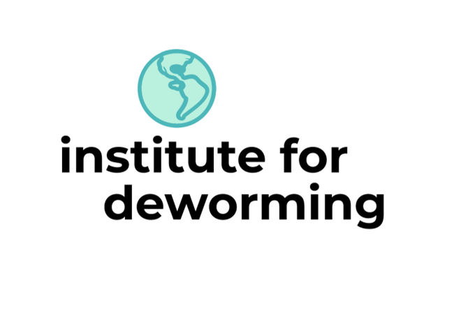

# Policy Analysis For Cost Effectiveness Analysis of Deworming Interventions (Advocate Analysts)

  

Open in RStudio:

Go straight to the Shiny app:

This repository and its accompanying dynamic document and Shiny app are
three key components of the Institute for Deworming’s study on the costs
and benefits of mass deworming interventions in various settings.
Together, these materials create a transparent and reproducible analysis
to facilitate collaboration and discussion about deworming policy.

1 - [An interactive plot](https://fhoces.shinyapps.io/shiny_app_test/),
which summarizes the interactions between all key parameters for a given
set of assumptions. Materials can be found in:
[`code/shiny_app`](https://github.com/advocacy-policy-analysis/pa-dw-yes-opaque-link/tree/master/code/shiny_app).

2 - This Github repository, which stores all data, code, and materials
necessary to replicate the analysis in full with minimal effort.
